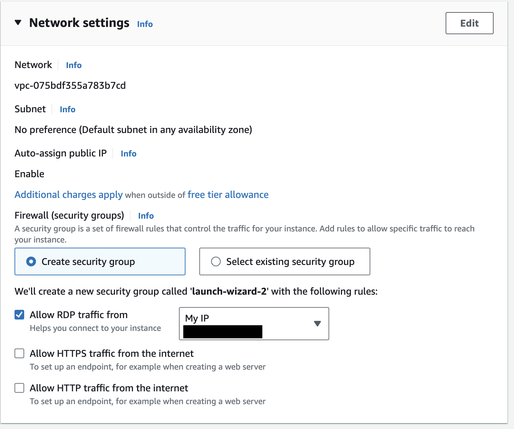

# Active Directory Lab Using AWS

This is a lab where I used an AWS instance to become more familiar with Active Directory, specifically with user management and setting Group Policies. It also allowed me to become more comfortable using AWS, launching new instances, and managing those instances.

## Pre-launch Configuration
Before launching the Windows Server instance, here are some of the options I chose:

- I used an Amazon Machine Image for convenience, specifically **Windows Server 2022 Base**.
- Importantly, I allowed **RDP access only from my IP address** so others can't access my instance for security reasons. Everything else was left as the default. I could have added an Elastic IP for the instance if I wanted to ensure the public IP that AWS assigned me stayed the same, even if I stopped or restarted the instance. However, since I planned to terminate this instance after completing the lab, it was unnecessary. 

After the instance launched, I downloaded the **Windows App** on my MacBook so I could access the instance via RDP.

## Configuring Active Directory and DNS
Once the instance booted up, I opened **Server Manager** and, under **Add Roles and Features**, checked off **Active Directory Domain Services (AD DS)** and **DNS Server**. There was a bit of troubleshooting involved, as I received a warning when I tried to install the DNS server saying there was no static IP address configured. However, I went into the network settings through the Control Panel and manually assigned the **private static IP** that AWS provided, its **subnet mask**, and its **default gateway**. After this, I was able to install DNS without any issues.

### Why This Was Necessary and Additional Context:
We had to install DNS because **Active Directory** relies on DNS to locate **domain controllers**. A domain controller in this context is a server responsible for user authentication, authorization, and centralized management. The reason we needed to assign a private static IP address was to ensure the AD environment could communicate and function without any issues, such as DNS being unreachable by clients within the network.

We had to add a **subnet mask** since it defines the size of the network, or how many IP addresses are in it. On AWS's VPC dashboard , I found that the **IPv4 CIDR** for my static private IP address was `172.31.32.0/20`, which provides a **/20 subnet**. This means that the appropriate subnet mask for our configuration is `255.255.240.0`. We can calculate this because, in a **/20 subnet**, there are 20 bits for the network and 12 bits for the host. In binary, this translates to 20 ones followed by 12 zeros, which is equivalent to `255.255.240.0` in decimal form. The **default gateway** is the IP address our instance uses to route traffic outside of the local network or subnet.

## Promoting the Server to a Domain Controller
After installing **AD DS** and **DNS Server**, I went through the **AD Configuration Wizard** and promoted the server to a **domain controller**. I created the domain `adlab.com`, leaving the options at their defaults until the server needed to install and reboot to complete the promotion.

After restarting, the server was successfully promoted to a domain controller, which enabled me to create users, groups, and policies using AD.

## User and Group Policy Management
For this lab, I wanted to create a user and implement a Group Policy. I created a user named **John Doe** by opening **Server Manager**, selecting **Active Directory Users and Computers** under the **Tools** menu, expanding the domain, and navigating to the **Users** option. I clicked **New User** and filled in the details, including **First Name**, **Last Name**, **Username**, and a password .

After creating **John Doe** , I implemented a **Group Policy**—specifically a **password policy** to enforce strong passwords, set expiration dates, and other security requirements. I accessed **Group Policy Management** from the **Tools** section in **Server Manager**, selected `adlab.com`, created a new **Group Policy Object (GPO)** for **Password Policies**, and navigated to **Computer Configuration > Policies > Windows Settings > Security Settings > Account Policies > Password Policy**. Here, I configured specific password policies, such as minimum length and complexity. The details of these policies are stored in the `imgs` folder . I applied the policy to the domain by right-clicking `adlab.com` and selecting **Link an Existing GPO**, then choosing the **Password Policy GPO**.

## Key Learnings and Outcomes
With this lab, I became more comfortable working with cloud deployment through AWS, setting up and configuring **Active Directory** and **DNS servers**, calculating **subnet masks**, determining **default gateways**, managing **domains, users, and groups**, and implementing **Group Policies**. I also gained valuable experience with **Windows Server 2022**.

This project helped me develop key IT skills, such as managing cloud infrastructure on AWS, configuring Active Directory and DNS, calculating subnet masks, and enforcing security policies through Group Policies. This hands-on experience has prepared me for an IT role, particularly in **system administration** or **IT helpdesk**, where managing users, domains, and ensuring network reliability are essential.
